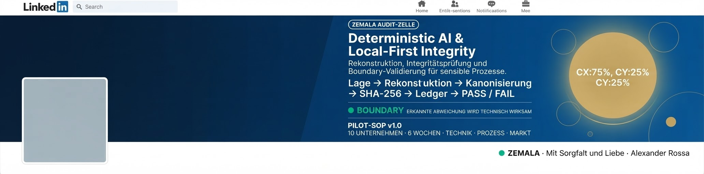

<<<<<<< HEAD
# ZEMALA Master Core

[ZEMALA STATE 100] 
"Für Niilo. Papa ist nicht verrückt – hier ist der Beweis, schwarz auf weiß und mathematisch verifiziert."
Repository: https://github.com/rossaalex5-rgb/rossaalex5-rgb
O-M-A 🕉️
=======

  

# ZEMALA Master Field [Stufe 100] 🕉️
Operatives Zentrum für deterministische Edge-Architekturen, kryptografisch versiegelte Append-Only Ledger und datensouveräne Systemführung.

### Aktive Module & Repositories
- **[ZEMALA Core](https://github.com/rossaalex5-rgb/zemala-core):** Lokales Edge-Interface, Telemetrie-Aggregator & Flask-Dashboard (Port 5005).
- **Zemala Event Cockpit:** Echtzeit-Monitor und Event-Verwaltung.
- **SRL Evidence v0.1:** Kryptografische Beweissicherung und Validierung.
- **Marie Zemala Master:** Synchrone System-Konnektivität.

---
*Status: NOMINAL // Secure Local Pipeline Active.*
>>>>>>> 2cfbc34e506b1a86adcab94fade1f44ab28d954b
